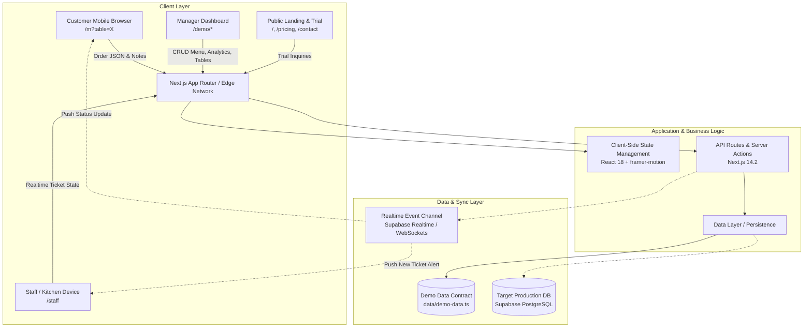

# Menus.ps — System Architecture Document

## 1. Executive Summary
Menus.ps is an Arabic-first, cloud-native restaurant digital menu and order management SaaS platform engineered specifically for the Palestinian hospitality market. The platform's defining architectural principle is **Hardware Independence**: it eliminates the capital expenditure of kitchen display terminals, proprietary POS machines, and printed paper menus.

---

## 2. Architecture Overview

---

## 3. Current Implementation State vs Production Target

| Layer | Current Implementation | Production Target Architecture |
| :--- | :--- | :--- |
| **Frontend Framework** | Next.js 14.2 App Router (`app/`) | Next.js 14.2 App Router (SSR + Static Landing + CSR Interactive App) |
| **State Management** | React `useState`, `useMemo`, localStorage | Zustand / TanStack Query + Supabase Realtime client |
| **Data Storage** | In-memory TypeScript collections (`@/data/demo-data.ts`) | Managed PostgreSQL on Supabase with Row Level Security (RLS) |
| **Authentication** | Client-side role simulation (`/login` email parsing) | Supabase Auth (JWT, Row Level Security, Branch PIN codes) |
| **Realtime Sync** | Polling & local state simulation | WebSockets via Supabase Realtime Channels (`postgres_changes`) |
| **Image Hosting** | External Unsplash URLs + `/public/logo.png` | Supabase Storage / Cloudflare R2 with WebP image optimization pipeline |
| **Printing System** | Browser `window.print()` wrappers | Thermal ESC/POS Bluetooth/Network direct print + PDF vector generation |

---

## 4. Frontend Component Architecture

### 4.1 Layouts
- `components/layout/PublicLayout.tsx`: Shared wrapper for public marketing pages (`/`, `/pricing`, `/how-it-works`, `/features`, `/faq`, `/contact`). Includes sticky compact `Navbar.tsx` (`h-14`) and main content area.
- `components/layout/DemoSidebar.tsx`: Persistent right-side drawer for Backoffice administration (`/demo/*`), providing navigation, tenant switcher, and a dedicated decoupled launcher for the Kitchen screen.
- Standalone viewports: `/m` (Customer mobile experience) and `/staff` (Kitchen ticket board) render as clean standalone applications without distracting chrome or sidebars.

### 4.2 Shared Design System
- **Colors**:
  - Primary Accent: Brand Orange (`#f97316` / `orange-500`)
  - Dark Slate: Slate 900 (`#0f172a`), Slate 950 (`#020617`)
  - Semantic Status: Emerald 500 (Ready/Open), Amber 500 (Cooking/Occupied), Rose 500 (New/Urgent), Blue 500 (Reserved)
- **Typography**: `IBM Plex Sans Arabic` (weights: 400, 500, 600, 700, 900).
- **Direction**: Right-to-Left (`dir="rtl"`).
