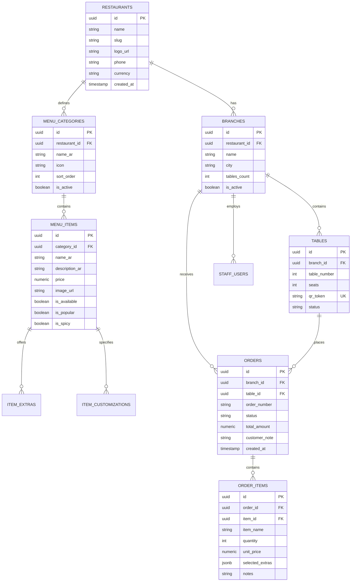

# Menus.ps — Database Schema Design

## 1. Schema Overview
The database is structured for multi-tenant Palestinian restaurant operations, supporting multi-branch organizations, real-time ticket flows, and table QR tokens.

---

## 2. Entity Relationship Diagram (ERD)



---

## 3. Detailed Table Definitions (SQL DDL)

```sql
-- 1. Tenants / Restaurants
CREATE TABLE restaurants (
    id UUID PRIMARY KEY DEFAULT gen_random_uuid(),
    name VARCHAR(255) NOT NULL,
    slug VARCHAR(100) UNIQUE NOT NULL,
    logo_url TEXT,
    phone VARCHAR(50),
    city VARCHAR(100) NOT NULL DEFAULT 'نابلس',
    currency VARCHAR(10) NOT NULL DEFAULT '₪',
    created_at TIMESTAMPTZ DEFAULT NOW(),
    updated_at TIMESTAMPTZ DEFAULT NOW()
);

-- 2. Branches
CREATE TABLE branches (
    id UUID PRIMARY KEY DEFAULT gen_random_uuid(),
    restaurant_id UUID NOT NULL REFERENCES restaurants(id) ON DELETE CASCADE,
    name VARCHAR(255) NOT NULL,
    city VARCHAR(100) NOT NULL,
    address TEXT,
    tables_count INT NOT NULL DEFAULT 10,
    is_active BOOLEAN NOT NULL DEFAULT TRUE,
    created_at TIMESTAMPTZ DEFAULT NOW()
);

-- 3. Tables & QR Security Tokens
CREATE TABLE tables (
    id UUID PRIMARY KEY DEFAULT gen_random_uuid(),
    branch_id UUID NOT NULL REFERENCES branches(id) ON DELETE CASCADE,
    table_number INT NOT NULL,
    seats INT NOT NULL DEFAULT 4,
    qr_token VARCHAR(64) UNIQUE NOT NULL DEFAULT encode(gen_random_bytes(24), 'hex'),
    status VARCHAR(20) NOT NULL DEFAULT 'فارغة' CHECK (status IN ('فارغة', 'مشغولة', 'محجوزة')),
    created_at TIMESTAMPTZ DEFAULT NOW(),
    UNIQUE(branch_id, table_number)
);

-- 4. Menu Categories
CREATE TABLE menu_categories (
    id UUID PRIMARY KEY DEFAULT gen_random_uuid(),
    restaurant_id UUID NOT NULL REFERENCES restaurants(id) ON DELETE CASCADE,
    name_ar VARCHAR(100) NOT NULL,
    icon VARCHAR(10) DEFAULT '🍔',
    sort_order INT NOT NULL DEFAULT 0,
    is_active BOOLEAN NOT NULL DEFAULT TRUE
);

-- 5. Menu Items
CREATE TABLE menu_items (
    id UUID PRIMARY KEY DEFAULT gen_random_uuid(),
    category_id UUID NOT NULL REFERENCES menu_categories(id) ON DELETE CASCADE,
    name_ar VARCHAR(255) NOT NULL,
    description_ar TEXT,
    price NUMERIC(10, 2) NOT NULL CHECK (price >= 0),
    image_url TEXT,
    is_available BOOLEAN NOT NULL DEFAULT TRUE,
    is_popular BOOLEAN NOT NULL DEFAULT FALSE,
    is_spicy BOOLEAN NOT NULL DEFAULT FALSE,
    sort_order INT NOT NULL DEFAULT 0,
    created_at TIMESTAMPTZ DEFAULT NOW()
);

-- 6. Item Extras (Add-ons)
CREATE TABLE item_extras (
    id UUID PRIMARY KEY DEFAULT gen_random_uuid(),
    item_id UUID NOT NULL REFERENCES menu_items(id) ON DELETE CASCADE,
    name_ar VARCHAR(100) NOT NULL,
    price NUMERIC(10, 2) NOT NULL DEFAULT 0
);

-- 7. Orders
CREATE TABLE orders (
    id UUID PRIMARY KEY DEFAULT gen_random_uuid(),
    branch_id UUID NOT NULL REFERENCES branches(id) ON DELETE CASCADE,
    table_id UUID NOT NULL REFERENCES tables(id) ON DELETE RESTRICT,
    order_number VARCHAR(50) NOT NULL,
    status VARCHAR(30) NOT NULL DEFAULT 'جديد' CHECK (status IN ('جديد', 'قيد التحضير', 'جاهز', 'تم التسليم', 'ملغي')),
    total_amount NUMERIC(10, 2) NOT NULL DEFAULT 0,
    customer_note TEXT,
    created_at TIMESTAMPTZ DEFAULT NOW(),
    updated_at TIMESTAMPTZ DEFAULT NOW()
);

-- 8. Order Items
CREATE TABLE order_items (
    id UUID PRIMARY KEY DEFAULT gen_random_uuid(),
    order_id UUID NOT NULL REFERENCES orders(id) ON DELETE CASCADE,
    item_id UUID REFERENCES menu_items(id) ON DELETE SET NULL,
    item_name VARCHAR(255) NOT NULL,
    quantity INT NOT NULL CHECK (quantity > 0),
    unit_price NUMERIC(10, 2) NOT NULL,
    selected_extras JSONB DEFAULT '[]'::jsonb,
    notes TEXT
);

-- 9. Staff Users & Roles
CREATE TABLE staff_users (
    id UUID PRIMARY KEY DEFAULT gen_random_uuid(),
    branch_id UUID NOT NULL REFERENCES branches(id) ON DELETE CASCADE,
    full_name VARCHAR(150) NOT NULL,
    role VARCHAR(30) NOT NULL CHECK (role IN ('owner', 'branch_manager', 'cashier', 'kitchen')),
    pin_hash VARCHAR(255) NOT NULL,
    is_active BOOLEAN NOT NULL DEFAULT TRUE
);
```

---

## 4. Row Level Security (RLS) Policies
- **Customer Anonymous Policy**: Customers possessing a valid `qr_token` can `SELECT` menu categories and items for the branch, and can `INSERT` a new order and order items for their specific `table_id`.
- **Kitchen Staff Policy**: Staff authenticated for a branch can `SELECT` and `UPDATE` status on `orders` and `order_items` belonging to that branch, but are restricted from accessing financial tables (`total_amount`, billing logs).
- **Tenant Admin Policy**: Owners have full `ALL` access to all rows matching their `restaurant_id`.
